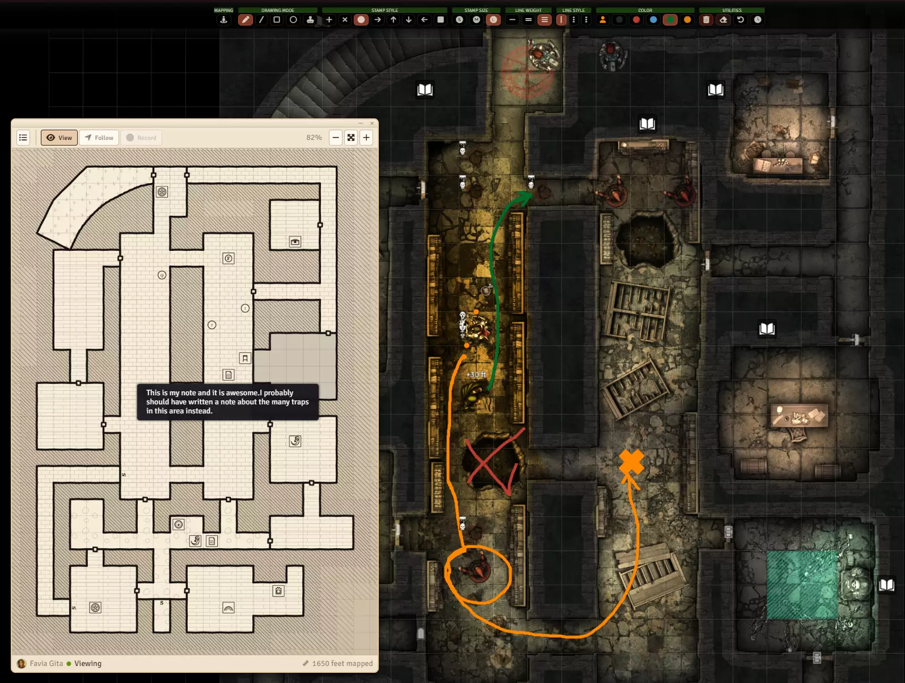

# Coffee Pub Cartographer


## Description

Party strategic planning, temporary canvas sketching, and shared old-school mapping.



## Features

- Temporary multiplayer canvas drawings with shapes, stamps, colors, and timed cleanup.
- A persistent party map that reveals the 5×5 grid area around a controlled token as it moves.
- A separate resizable map view using Blacksmith's Light, Dark, and Glass Tool window themes.

## Requirements

- **FoundryVTT**: Version 13 or 14
- **Coffee Pub Blacksmith**: 14.1.0 or later. Required dependency - provides shared services and functionality

## Installation

1. Inside Foundry VTT, use the following manifest URL:
   ```
   https://github.com/Drowbe/coffee-pub-cartographer/releases/latest/download/module.json
   ```
2. Enable the module in your game world's module settings
3. Ensure Coffee Pub Blacksmith is installed and enabled

## Usage

Open Cartographer from the Blacksmith menubar to access its drawing and mapping tools.

Select one token and open **Mapping** from the Cartographer toolbar to load the existing party map with that token centered. Press **Record** to add its exploration: newly discovered tiles fade into the map as it records the 5×5 grid area surrounding the token. Press **Stop** to stop recording while retaining the selected-token view, or close the window to stop and close it. Right-drag the map to pan it and use the mouse wheel to zoom around the cursor.

## Configuration

Module settings can be found in: Configure Settings → Coffee Pub Cartographer

## Contributing

Contributions are welcome! Please feel free to submit a Pull Request.

<!-- global:ai-assistance -->
## AI Assistance and the Illusion of Good Code

I started writing Foundry modules for use at my own table back in 2020. There were already a ton of amazing modules out there, but they either didn't quite do what I wanted or didn't deliver the kind of user experience I was looking for.

I've been a design leader for more than 20 years, but I spent the first half of my career as a developer, so building my own modules seemed like a fun way to kill some time. I'm a pretty good designer. I'm a decent developer. But, over time, my hand-written code and hacks got a little messy (and memory-leaky, and a little buggy. Feels good to say it out loud.).

Today, the Coffee Pub suite of modules is developed with AI assistance, primarily Claude and Cursor, for documentation, refactoring, debugging, and other development work. Every change is reviewed and committed by me, and nothing reaches a release that I haven't crawled and run at my own table. I can't seem to give up my IDE. The UX design, architecture, and ideas still come from my own fever dreams and chronic lack of sleep.

Testing and verifying a change means running it in Foundry so I can watch the console, break things, fix them, and hone the experience. The repositories carry a set of tools for testing the things that are difficult to catch through review and manual testing alone. They help ensure styles don't conflict, shared coding and documentation standards stay consistent, and the suite of modules continues to work well as a system without silently breaking.

Those checks are there because AI-assisted development can move very quickly, and without oversight, engagement, and planning, it can also go confidently off the rails and deliver the illusion of good code. The AI helps me build faster. It doesn't decide what gets built, its architecture, or how it should work. You can blame this human for that.

If the idea of AI-assisted development keeps you up at night or just isn't your jam, no worries at all. I get it. You do you.
<!-- /global:ai-assistance -->

## License

This module is licensed under the MIT License.

---

Part of the Coffee Pub module collection

