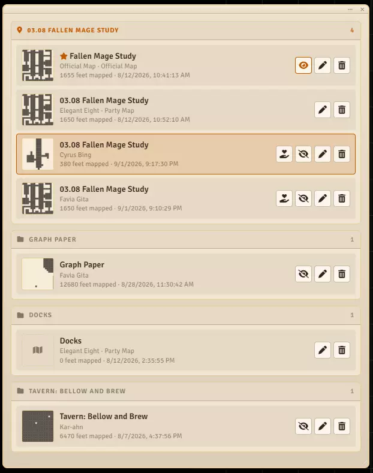

# Kinds of Map

**Audience:** anyone deciding who should see a map, or building one the whole party shares.

The three kinds of map, how to share your own, how the party map gets filled, and how a found map
reaches the table.

## Your own map

A **player map** is one character's record of one scene, drawn as their token walks. It is yours: you
record it, you correct it, you name it.

**It is private until you share it.** Nobody else sees it in their list -- not the other players, and
not until you say so.

Worth knowing what that means exactly: the map still travels to every client the way the scene's
walls always have, so this decides whose list it appears in rather than what somebody determined
could reach with a browser console open. For a table of people playing a game together, that is the
useful meaning of private.

**To share it:** press the eye on its row in **Recorded Maps**. Press it again to take it back.

## The party map

One shared map per scene, which the whole party owns together. Any member can annotate and correct
it; only the GM can reset or delete it.

**To start it:** choose **Start the Party Map** at the top of the list. There is only ever one per
scene, so the card disappears once it exists.

There are exactly two ways to add to it, and it is never drawn by hand:

**Donate a map you have already recorded.** Press **Donate to the party map** on your own map's row.
Everything you have walked is handed over at once.

**Record into it.** Open the party map and press **Record**. Everything you walk goes to the party's
map as you walk it -- and to your own at the same time. You do not lose your own record by
contributing; it is one walk writing to both.

The two are the same act at different moments: donate afterwards, or donate continuously.

**Donating only ever adds.** Nothing is taken away, which has three consequences worth knowing:

- Donating twice does nothing the second time.
- A square you struck off your own map is **not** struck off the party's. Somebody else may have
  walked it and given it to them, and your correction is about your map.
- Where the party map already has a floor surface or already knows which way a square lies, yours
  does not overwrite it. Whatever was settled first stands.

**Who can do it:** anyone in the party. Contributing is always a decision -- exploring never donates
anything on your behalf, and you may keep your own map to yourself for your own reasons.

## Official maps

An **official map** is an artifact: a plan of a place rather than a record of a visit. It is the map
the party finds in a dead wizard's study.

A GM creates one with **Author an Official Map**, and the whole scene arrives already mapped -- no
token walks it, because a map that was drawn by somebody else makes no claim about where anyone has
been.

**It starts hidden.** Players do not see it in their list at all until the GM reveals it, which is
the point: a plan of a dungeon is meant to be turned up rather than handed over.

Once revealed, the party can write in its margins but not rewrite it. You may add notes and symbols,
and take back your own additions, but you cannot remove what its author drew or what another player
added. That is what makes it an artifact rather than another map to edit.

Official maps are marked with a star in the list.

## Telling them apart in the list

Every row says which kind it is, and the shared maps come first within each group: the official map
of the place, then the party's, then everybody's own.

## What each kind allows

| | Your own map | Another player's | The party map | An official map |
|---|---|---|---|---|
| See it | yes | only if shared | any member | only once revealed |
| Record into it | yes | no | yes, which also fills your own | no |
| Add notes and symbols | yes | no | any member | yes, once revealed |
| Remove what is there | yes | no | any member | your own additions only |
| Floor surfaces and Fix Things | yes | no | any member | GM only |
| Rename | yes | no | any member | GM only |
| Reset or delete | yes | no | GM only | GM only |
